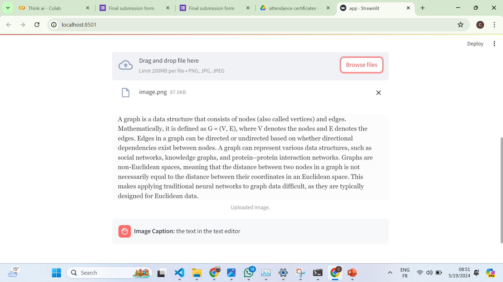

# 9errini

9errini is a Streamlit-based chatbot application that leverages Hugging Face models for natural language processing tasks. It allows users to chat with the meta-llama-3-8b model, upload images to get captions, and simplify text within the images.

## Table of Contents

- [Installation](#installation)
- [Usage](#usage)
- [Technologies Used](#technologies-used)
- [License](#license)
- [Acknowledgments](#acknowledgments)

## Installation

To install and run the 9errini application locally, follow these steps:

1. Clone the repository:
git clone https://github.com/charaf19/9errini.git

2. Navigate to the project directory:
cd 9errini

3. Install the required dependencies:
pip install -r requirements.txt

4. Run the Streamlit application:
streamlit run app.py

## Interface Overview

This screenshot demonstrates the user interface of the 9errini application. Users can interact with the chatbot by typing messages in the input box or uploading images for captioning and text simplification.

## Usage

- Launch the Streamlit application by following the installation instructions.
- Input your message in the text box and click "Send" to receive a response from the ChatGPT model.
- You can also upload images to get captions and simplified text.

## Technologies Used

9errini is built using the following technologies:

- Python: Programming language used for the backend logic.
- Streamlit: Framework used for building the user interface.
- Hugging Face Transformers: Library used for natural language processing tasks.
- Pytesseract: Library used for optical character recognition (OCR) of images.
- PIL (Python Imaging Library): Library used for image processing tasks.

## License

This project is licensed under the MIT License. See the [LICENSE](LICENSE) file for details.

## Acknowledgments

The development of 9errini was made possible thanks to the following resources:

- [Hugging Face](https://huggingface.co/)
- [Streamlit](https://streamlit.io/)
- [Pytesseract](https://github.com/madmaze/pytesseract)
- [PIL (Python Imaging Library)](https://pillow.readthedocs.io/en/stable/)

